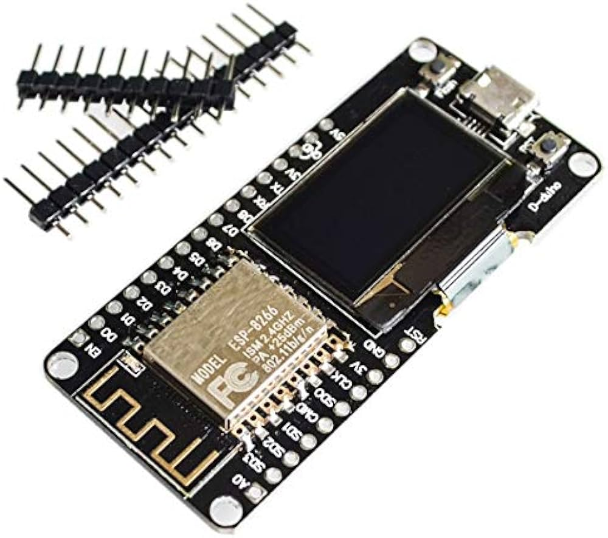
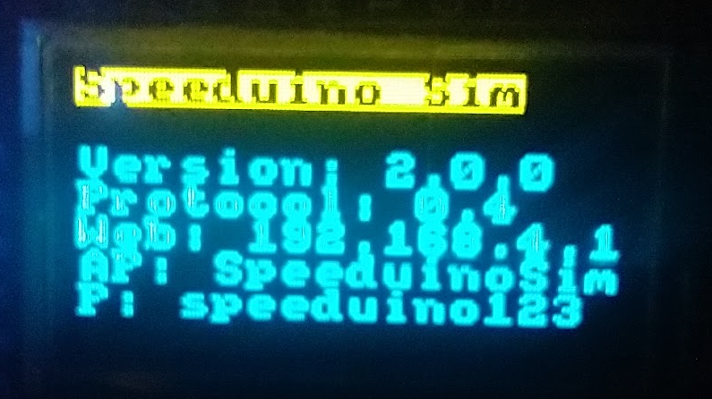

# Speeduino Serial Simulator - NodeMCU with OLED version

A cross-platform Speeduino ECU serial interface simulator with realistic I4 engine simulation, supporting Arduino AVR, ESP32, and ESP8266. 

Based on the work of:
- **Author**: Arvis Krējāns
- **GitHub**: [@askrejans](https://github.com/askrejans)

## 🚀 Features

See https://github.com/askrejans/speeduino-serial-sim for all details.

Board:

Display:

## 📜 License

MIT License - See [LICENSE](LICENSE)

Based on **Version**: 2.0.0 of speeduino-serial-sim
